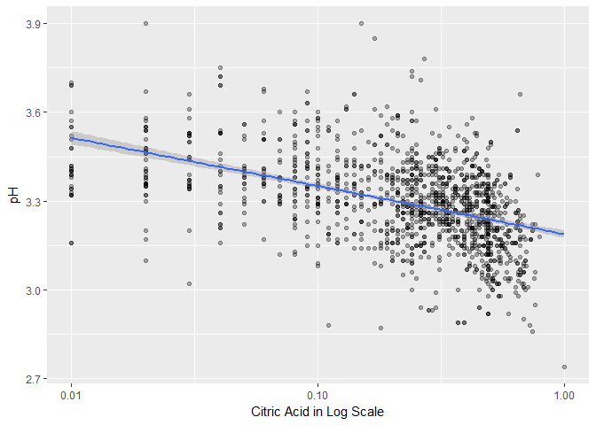
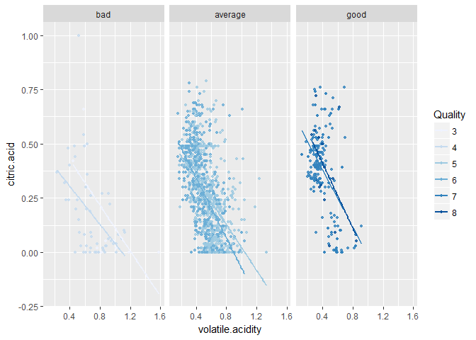

Red Wine Analysis
================
Sagarnil Das
June 21, 2017

``` r
#Load all the required libraries
library("ggplot2")
library("dplyr")
library("gridExtra")
library(Simpsons)
library(GGally)
library(memisc)
library(pander)
library(corrplot)
```

Target of this Project
----------------------

In this project, I will analyze the Red Wine Data and try to understand which variables are responsible for the quality of the wine. First I will try to get a feel of the variables on their own and then I will try to find out the correlation between them and the Wine Quality with other factors thrown in. Finally I will create a linear model to predict the outcome of a test set data.

``` r
#Loading the csv file
wine <- read.csv('wineQualityReds.csv')

#Transforming Quality from an Integer to a Factor
wine$quality <- factor(wine$quality, ordered = T)

#Creating a new Factored Variable called 'Rating'

wine$rating <- ifelse(wine$quality < 5, 'bad', ifelse(
  wine$quality < 7, 'average', 'good'))

wine$rating <- ordered(wine$rating,
                       levels = c('bad', 'average', 'good'))
```

Structure and summary of the Dataframe
--------------------------------------

    ## 'data.frame':    1599 obs. of  14 variables:
    ##  $ X                   : int  1 2 3 4 5 6 7 8 9 10 ...
    ##  $ fixed.acidity       : num  7.4 7.8 7.8 11.2 7.4 7.4 7.9 7.3 7.8 7.5 ...
    ##  $ volatile.acidity    : num  0.7 0.88 0.76 0.28 0.7 0.66 0.6 0.65 0.58 0.5 ...
    ##  $ citric.acid         : num  0 0 0.04 0.56 0 0 0.06 0 0.02 0.36 ...
    ##  $ residual.sugar      : num  1.9 2.6 2.3 1.9 1.9 1.8 1.6 1.2 2 6.1 ...
    ##  $ chlorides           : num  0.076 0.098 0.092 0.075 0.076 0.075 0.069 0.065 0.073 0.071 ...
    ##  $ free.sulfur.dioxide : num  11 25 15 17 11 13 15 15 9 17 ...
    ##  $ total.sulfur.dioxide: num  34 67 54 60 34 40 59 21 18 102 ...
    ##  $ density             : num  0.998 0.997 0.997 0.998 0.998 ...
    ##  $ pH                  : num  3.51 3.2 3.26 3.16 3.51 3.51 3.3 3.39 3.36 3.35 ...
    ##  $ sulphates           : num  0.56 0.68 0.65 0.58 0.56 0.56 0.46 0.47 0.57 0.8 ...
    ##  $ alcohol             : num  9.4 9.8 9.8 9.8 9.4 9.4 9.4 10 9.5 10.5 ...
    ##  $ quality             : Ord.factor w/ 6 levels "3"<"4"<"5"<"6"<..: 3 3 3 4 3 3 3 5 5 3 ...
    ##  $ rating              : Ord.factor w/ 3 levels "bad"<"average"<..: 2 2 2 2 2 2 2 3 3 2 ...

    ##        X          fixed.acidity   volatile.acidity  citric.acid   
    ##  Min.   :   1.0   Min.   : 4.60   Min.   :0.1200   Min.   :0.000  
    ##  1st Qu.: 400.5   1st Qu.: 7.10   1st Qu.:0.3900   1st Qu.:0.090  
    ##  Median : 800.0   Median : 7.90   Median :0.5200   Median :0.260  
    ##  Mean   : 800.0   Mean   : 8.32   Mean   :0.5278   Mean   :0.271  
    ##  3rd Qu.:1199.5   3rd Qu.: 9.20   3rd Qu.:0.6400   3rd Qu.:0.420  
    ##  Max.   :1599.0   Max.   :15.90   Max.   :1.5800   Max.   :1.000  
    ##  residual.sugar     chlorides       free.sulfur.dioxide
    ##  Min.   : 0.900   Min.   :0.01200   Min.   : 1.00      
    ##  1st Qu.: 1.900   1st Qu.:0.07000   1st Qu.: 7.00      
    ##  Median : 2.200   Median :0.07900   Median :14.00      
    ##  Mean   : 2.539   Mean   :0.08747   Mean   :15.87      
    ##  3rd Qu.: 2.600   3rd Qu.:0.09000   3rd Qu.:21.00      
    ##  Max.   :15.500   Max.   :0.61100   Max.   :72.00      
    ##  total.sulfur.dioxide    density             pH          sulphates     
    ##  Min.   :  6.00       Min.   :0.9901   Min.   :2.740   Min.   :0.3300  
    ##  1st Qu.: 22.00       1st Qu.:0.9956   1st Qu.:3.210   1st Qu.:0.5500  
    ##  Median : 38.00       Median :0.9968   Median :3.310   Median :0.6200  
    ##  Mean   : 46.47       Mean   :0.9967   Mean   :3.311   Mean   :0.6581  
    ##  3rd Qu.: 62.00       3rd Qu.:0.9978   3rd Qu.:3.400   3rd Qu.:0.7300  
    ##  Max.   :289.00       Max.   :1.0037   Max.   :4.010   Max.   :2.0000  
    ##     alcohol      quality     rating    
    ##  Min.   : 8.40   3: 10   bad    :  63  
    ##  1st Qu.: 9.50   4: 53   average:1319  
    ##  Median :10.20   5:681   good   : 217  
    ##  Mean   :10.42   6:638                 
    ##  3rd Qu.:11.10   7:199                 
    ##  Max.   :14.90   8: 18

Univariate Plots
----------------

First, before doing any analysis between the variables, I am going to plot the distribution of each of the variable as I would like to get a feel of the variables first. Based on the distribution shape, i.e. Normal, Positive Skew or Negative Skew, this will also help me to get some sense what to expect when I plot different variables against each other. Also for many variables, there are extreme outliers present in this dataset. For those, I will remove the extreme outliers for a more robust analysis.


One thing I am seeing from the above two plots is most of the wines in the dataset are average quality wines. So I am wondering whether this data collected is accurate or complete or not. Was this data collected from a specific geographical location? Or was it spread around a big area? As the good quality and the poor quality wines are almost like outliers here, it might be difficult to get an accurate model of the Wine Quality. Let's look at the other plots.


The distribution of Fixed Acidity is positively skewed. The median is around 8 with high concentration of wines with Fixed Acidity but due to some outliers, the mean has been dragged to around 9.4. The image has been rescaled to get rid of the high outliers.


The distribution of Volatile acidity looks like Bimodal with two peaks around 0.4 and 0.6.


Apart from some outliers, the distribution of Citric acid looks strange. Some higher values have no data at all and apart from them, the distribution looks almost rectangular. Maybe there was some error in the data or maybe the data collected was incomplete?


The distribution of Residual Sugar is again positively skewed with high peaks at around 2.3 with many outliers present at the higher ranges.


For Chlorides also, we see a similar distribution like Residual Sugar. We have got rid of extreme outliers in this image.


For Free Sulphur Dioxide, there is a high peak at 7 but then it again follows the same positively skewed long tailed patterns with some outliers in the high range.


Being a superset of the previous variable, Total Sulphur Dioxide also follows a similar pattern.


For the Density variable, we see something new for the first time. This Variable has almost a perfect Normal Distribution.


pH also has a very Normally distributed shape.


Sulphates also exhibit a similar long tailed distribution like Chlorides or Free/Total Sulphur Dioxide. It has relatively less outliers.


Alcohol also follows a skewed distribution but here the skewness is less than that of Chlorides or Residual Sugars.

Analysis of the Univariate Plots
--------------------------------

### Dataset Structure

The Red Wine Dataset had 1599 rows and 13 columns originally. After I added a new column called 'rating', the number of columns became 14. Here our categorical variable is 'quality', and the rest of the variables are numerical variables which reflect the physical and chemical properties of the wine.

I also see that in this dataset, most of the wines belong to the 'average' quality with very few 'bad' and 'good' ones. Now this again raises my doubt if this dataset is a complete one or not. For the lack of these data, it might be challenging to build a predictive model as I don't have enough data for the Good Quality and the Bad Quality wines.

### Point of Interest

My main point of interest in this dataset is the 'quality'. I would like to determine which factors determine the quality of a wine.

### My initial thoughts and Hypothesis

Without analyzing the data, I think maybe the acidity(fixed, volatile or citric) will change the quality of wine based on their values. Also pH as related to acidity may have some effect on the quality. Also this would be an interesting thing to see how the pH is affected by the different acids present in the wine and if the overall pH affects the quality of the wine. I also think the residual sugar will have an effect on the wine quality as sugar determines how sweet the wine will be and may adversely affect the taste of the wine.

### Unique features of the dataset

Citric acid has a unique distribution as compared to the other numeric variables. It almost has a rectangular shape apart from a few outliers. Now if we compare the wine quality distribution, this distribution of Citric Acid is very unexpected and maybe there is even a possibility of incomplete data collection.

### Distribution and Outliers

1.  Density and pH seems normally distributed with few outliers.

2.  Residual sugar and Chloride seems to have extreme outliers.

3.  Fixed and volatile acidity, total and free sulfur dioxides, alcohol and sulphates seem to be long-tailed for the outliers present.

4.  Citric acid has large number of zero values. I wonder if this is due to incomplete data entry.

Bivariate Plots
---------------

First I will create a correlation table between the variables present in this dataset so that I get some initial guidance about which ones may be correlated to each other.

``` r
c <- cor(
  wine %>%
    # first we remove unwanted columns
    dplyr::select(-X) %>%
    dplyr::select(-rating) %>%
    mutate(
      # now we translate quality to a number
      quality = as.numeric(quality)
    )
)
emphasize.strong.cells(which(abs(c) > .3 & c != 1, arr.ind = TRUE))
pandoc.table(c)
```

    ## 
    ## ---------------------------------------------------------------------------
    ##           &nbsp;            fixed.acidity   volatile.acidity   citric.acid 
    ## -------------------------- --------------- ------------------ -------------
    ##     **fixed.acidity**             1             -0.2561        **0.6717**  
    ## 
    ##    **volatile.acidity**        -0.2561             1           **-0.5525** 
    ## 
    ##      **citric.acid**         **0.6717**       **-0.5525**           1      
    ## 
    ##     **residual.sugar**         0.1148           0.001918         0.1436    
    ## 
    ##       **chlorides**            0.09371           0.0613          0.2038    
    ## 
    ##  **free.sulfur.dioxide**       -0.1538          -0.0105         -0.06098   
    ## 
    ##  **total.sulfur.dioxide**      -0.1132          0.07647          0.03553   
    ## 
    ##        **density**            **0.668**         0.02203        **0.3649**  
    ## 
    ##           **pH**             **-0.683**          0.2349        **-0.5419** 
    ## 
    ##       **sulphates**             0.183            -0.261        **0.3128**  
    ## 
    ##        **alcohol**            -0.06167          -0.2023          0.1099    
    ## 
    ##        **quality**             0.1241         **-0.3906**        0.2264    
    ## ---------------------------------------------------------------------------
    ## 
    ## Table: Table continues below
    ## 
    ##  
    ## -----------------------------------------------------------------------------
    ##           &nbsp;            residual.sugar   chlorides   free.sulfur.dioxide 
    ## -------------------------- ---------------- ----------- ---------------------
    ##     **fixed.acidity**           0.1148        0.09371          -0.1538       
    ## 
    ##    **volatile.acidity**        0.001918       0.0613           -0.0105       
    ## 
    ##      **citric.acid**            0.1436        0.2038          -0.06098       
    ## 
    ##     **residual.sugar**            1           0.05561           0.187        
    ## 
    ##       **chlorides**            0.05561           1            0.005562       
    ## 
    ##  **free.sulfur.dioxide**        0.187        0.005562             1          
    ## 
    ##  **total.sulfur.dioxide**       0.203         0.0474         **0.6677**      
    ## 
    ##        **density**            **0.3553**      0.2006          -0.02195       
    ## 
    ##           **pH**               -0.08565       -0.265           0.07038       
    ## 
    ##       **sulphates**            0.005527     **0.3713**         0.05166       
    ## 
    ##        **alcohol**             0.04208        -0.2211         -0.06941       
    ## 
    ##        **quality**             0.01373        -0.1289         -0.05066       
    ## -----------------------------------------------------------------------------
    ## 
    ## Table: Table continues below
    ## 
    ##  
    ## -------------------------------------------------------------------------
    ##           &nbsp;            total.sulfur.dioxide    density       pH     
    ## -------------------------- ---------------------- ----------- -----------
    ##     **fixed.acidity**             -0.1132          **0.668**  **-0.683** 
    ## 
    ##    **volatile.acidity**           0.07647           0.02203     0.2349   
    ## 
    ##      **citric.acid**              0.03553         **0.3649**  **-0.5419**
    ## 
    ##     **residual.sugar**             0.203          **0.3553**   -0.08565  
    ## 
    ##       **chlorides**                0.0474           0.2006      -0.265   
    ## 
    ##  **free.sulfur.dioxide**         **0.6677**        -0.02195     0.07038  
    ## 
    ##  **total.sulfur.dioxide**            1              0.07127    -0.06649  
    ## 
    ##        **density**                0.07127              1      **-0.3417**
    ## 
    ##           **pH**                  -0.06649        **-0.3417**      1     
    ## 
    ##       **sulphates**               0.04295           0.1485      -0.1966  
    ## 
    ##        **alcohol**                -0.2057         **-0.4962**   0.2056   
    ## 
    ##        **quality**                -0.1851           -0.1749    -0.05773  
    ## -------------------------------------------------------------------------
    ## 
    ## Table: Table continues below
    ## 
    ##  
    ## --------------------------------------------------------------
    ##           &nbsp;            sulphates    alcohol     quality  
    ## -------------------------- ----------- ----------- -----------
    ##     **fixed.acidity**         0.183     -0.06167     0.1241   
    ## 
    ##    **volatile.acidity**      -0.261      -0.2023   **-0.3906**
    ## 
    ##      **citric.acid**       **0.3128**    0.1099      0.2264   
    ## 
    ##     **residual.sugar**      0.005527     0.04208     0.01373  
    ## 
    ##       **chlorides**        **0.3713**    -0.2211     -0.1289  
    ## 
    ##  **free.sulfur.dioxide**     0.05166    -0.06941    -0.05066  
    ## 
    ##  **total.sulfur.dioxide**    0.04295     -0.2057     -0.1851  
    ## 
    ##        **density**           0.1485    **-0.4962**   -0.1749  
    ## 
    ##           **pH**             -0.1966     0.2056     -0.05773  
    ## 
    ##       **sulphates**             1        0.09359     0.2514   
    ## 
    ##        **alcohol**           0.09359        1      **0.4762** 
    ## 
    ##        **quality**           0.2514    **0.4762**       1     
    ## --------------------------------------------------------------

1.  The very first thing that caught my eye in this table is that Volatile acidity has a positive correlation with pH. But how can that be possible! We know that with the decrease in pH, acidity increases. So is it possible that a Simpson's Paradox is at play here? I will further investigate this peculiar characteristic.

2.  Density has a very strong correlation with Fixed Acidity.

3.  The variables most strongly correlated to quality are Volatile Acidity and Alcohol.

4.  Alcohol has negative correlation with density. This is evident from the fact that the density of water is greater than the density of alcohol.

Now let us create some Box plots between these variables to see if I have missed anything from the correlation table.


As we can see, Fixed Acidity has almost no effect on the Quality. The mean and median values of fixed acidity remains almost unchanged with increase in quality.


Volatile acid seems to have a negative impact on the quality of the wine. As volatile acid level goes up, the quality of the wine degrades.


Citric acid seems to have a positive correlation with Wine Quality. Better wines have higher Citric Acid.


Previously I thought that Residual Sugar may have an effect on the wine quality. But this plot contradicts that assumption and shows that Residual Sugar almost has no effect on the Quality of the Wine. The mean values for the residual sugar is almost the same for every quality of wine.


Even though weakly correlated, from the decrease in median values of the Chlorides with increase in quality, it seems that lower percent of Chloride seems to produce better wines.


Now this is an interesting observation. We see that too low concentration of Free Sulphur Dioxide produces poor wine and too high concentration results in average wine.


As this is a Subset of Free Sulphur Dioxide, we see a similar pattern here.


Better wines seems to have lower densities. But may be it will be wise not to draw any conclusions here. Because there might be a possibility that the low density is due to higher alcohol content which actually is the driving factor for better wines.


Better wines seems to have less pH, i.e they are more acidic. But there are a quite a few outliers here. So maybe the next logical thing would be to see how the individual acids affects the pH.




These three plots make us come back to our old question. Recall that we saw for Volatile Acid, pH has a positive correlation. But we know acidity has a negative correlation with pH. So is it possible, that we are seeing a Simpson's Paradox at play here? Let's investigate.


Wow! So it is indeed Simpson's paradox which was responsible for the trend reversal of Volatile Acid vs pH. I clustered the data into 3 segments and calculated the regression coefficient. I see that there is indeed a sign reversal. This is due to a lurking variable which changes the overall coefficient.


Even though we see many outliers in the 'Average' quality wine, it seems that better wines have a stronger concentration of Sulphates.


The correlation is really distinct here. It is pretty evident that better wines have higher Alcohol content in it. But we see a great number of outliers here. So it might be possible that alcohol alone does not contribute to a wine being a good quality one. Let's make a simple linear model and try to get the statistics here.

    ## 
    ## Call:
    ## lm(formula = as.numeric(quality) ~ alcohol, data = wine)
    ## 
    ## Residuals:
    ##     Min      1Q  Median      3Q     Max 
    ## -2.8442 -0.4112 -0.1690  0.5166  2.5888 
    ## 
    ## Coefficients:
    ##             Estimate Std. Error t value Pr(>|t|)    
    ## (Intercept) -0.12503    0.17471  -0.716    0.474    
    ## alcohol      0.36084    0.01668  21.639   <2e-16 ***
    ## ---
    ## Signif. codes:  0 '***' 0.001 '**' 0.01 '*' 0.05 '.' 0.1 ' ' 1
    ## 
    ## Residual standard error: 0.7104 on 1597 degrees of freedom
    ## Multiple R-squared:  0.2267, Adjusted R-squared:  0.2263 
    ## F-statistic: 468.3 on 1 and 1597 DF,  p-value: < 2.2e-16

Based on the value of R squared, we see that Alcohol alone contributes to only about 22% of the Wine quality. So there must be other variables at play here. I have to figure them out in order to build a better regression model.

So now I will put a correlation test against each variable to the quality of the wine.

    ##        fixed.acidity     volatile.acidity          citric.acid 
    ##           0.12405165          -0.39055778           0.22637251 
    ## log10.residual.sugar      log10.chlordies  free.sulfur.dioxide 
    ##           0.02353331          -0.17613996          -0.05065606 
    ## total.sulfur.dioxide              density                   pH 
    ##          -0.18510029          -0.17491923          -0.05773139 
    ##      log10.sulphates              alcohol 
    ##           0.30864193           0.47616632

From the correlation test, it seems that the following variables have a higher correlation to Wine Quality.

1.  Alcohol
2.  Sulphates(log10)
3.  Volatile Acidity
4.  Citric Acid

Analysis of Bivariate Plots
---------------------------

### Observations

1.  Fixed Acidity seems to have almost no effect on quality.
2.  Volatile Acidity seems to have a negative correlation with the quality.
3.  Better wines seem to have higher concentration of Citric Acid.
4.  Better wines seem to have higher alcohol percentages. But when I created a linear model around it, I saw from the R squared value that alcohol by itself only contributes like 20% on the variance of the quality. So there may be some other factors at play here.
5.  Even though it's a weak correlation, but lower percent of Chloride seems to produce better quality wines.
6.  Better wines seem to have lower densities. But then again, this may be due to the higher alcohol content in them.
7.  Better wines seem to be more acidic.
8.  Residual sugar almost has no effect on the wine quality.

### Special features

Volatile acidity had a positive correlation with pH which at first was totally unexpected to me. Later I found out that this was due to the Simpson's Paradox.

Multivariate Plots
------------------

As we saw, that alcohol plays a strong part in the quality of the wine even though it actually contributes only 22% of the total quality, now I will first make alcohol constant and try to insert a few more variables to see if they contribute to the overall quality in any other way.


With constant Alcohol, Density does not seem to play a prominet role in changing the quality of the alcohol. So our previous suspicion must be true that the correlation we were seeing of density with quality was due to alcohol percent.


It looks like Wines with higher alcohol content produce better wine if they have higher level of Sulphates.


It looks like Volatile acid has just the opposite effect. With less concentration of volatile acid and higher concentration of alcohol seems to produce better wines.


Here also, low pH and high Alcohol percentage seems to produce better wines.


No such correlation between residual sugar and quality.


In general lower Sulphur Dioxide seems to produces better wine even though some high outliers for better wine with high Sulphur Dioxide.

Now let us try to investigate the effect of Acids on the Quality of Wines.



Higher Citric Acid and low Volatile Acid seems to produce better Wines.


I don't see much correlations here.


Again, I don't get much correlation with the quality here.

Linear Modelling
----------------

Now after all these analysis, I am going to take the variables which are most strongly correlated with the quality of the wine and generate a linear model with them.

``` r
set.seed(1221)
training_data <- sample_frac(wine, .6)
test_data <- wine[ !wine$X %in% training_data$X, ]
m1 <- lm(as.numeric(quality) ~ alcohol, data = training_data)
m2 <- update(m1, ~ . + sulphates)
m3 <- update(m2, ~ . + volatile.acidity)
m4 <- update(m3, ~ . + citric.acid)
m5 <- update(m4, ~ . + fixed.acidity)
m6 <- update(m2, ~ . + pH)
mtable(m1,m2,m3,m4,m5,m6)
```

    ## 
    ## Calls:
    ## m1: lm(formula = as.numeric(quality) ~ alcohol, data = training_data)
    ## m2: lm(formula = as.numeric(quality) ~ alcohol + sulphates, data = training_data)
    ## m3: lm(formula = as.numeric(quality) ~ alcohol + sulphates + volatile.acidity, 
    ##     data = training_data)
    ## m4: lm(formula = as.numeric(quality) ~ alcohol + sulphates + volatile.acidity + 
    ##     citric.acid, data = training_data)
    ## m5: lm(formula = as.numeric(quality) ~ alcohol + sulphates + volatile.acidity + 
    ##     citric.acid + fixed.acidity, data = training_data)
    ## m6: lm(formula = as.numeric(quality) ~ alcohol + sulphates + pH, 
    ##     data = training_data)
    ## 
    ## ======================================================================================
    ##                        m1         m2         m3         m4         m5         m6      
    ## --------------------------------------------------------------------------------------
    ##   (Intercept)        0.155     -0.273      0.866***   0.973***   0.497      1.494**   
    ##                     (0.220)    (0.224)    (0.247)    (0.254)    (0.287)    (0.515)    
    ##   alcohol            0.333***   0.320***   0.286***   0.284***   0.296***   0.339***  
    ##                     (0.021)    (0.021)    (0.020)    (0.020)    (0.020)    (0.021)    
    ##   sulphates                     0.855***   0.599***   0.650***   0.667***   0.733***  
    ##                                (0.126)    (0.124)    (0.127)    (0.126)    (0.129)    
    ##   volatile.acidity                        -1.153***  -1.279***  -1.352***             
    ##                                           (0.124)    (0.143)    (0.144)               
    ##   citric.acid                                        -0.231     -0.629***             
    ##                                                      (0.132)    (0.174)               
    ##   fixed.acidity                                                  0.058***             
    ##                                                                 (0.017)               
    ##   pH                                                                       -0.569***  
    ##                                                                            (0.149)    
    ## --------------------------------------------------------------------------------------
    ##   R-squared              0.2        0.2       0.3        0.3        0.3        0.3    
    ##   adj. R-squared         0.2        0.2       0.3        0.3        0.3        0.3    
    ##   sigma                  0.7        0.7       0.7        0.7        0.7        0.7    
    ##   F                    252.3      155.1     141.8      107.3       89.3      109.7    
    ##   p                      0.0        0.0       0.0        0.0        0.0        0.0    
    ##   Log-likelihood     -1027.5    -1005.0    -963.1     -961.6     -955.6     -997.8    
    ##   Deviance             478.7      456.7     418.5      417.2      411.9      449.8    
    ##   AIC                 2061.1     2018.0    1936.3     1935.2     1925.1     2005.6    
    ##   BIC                 2075.7     2037.5    1960.6     1964.4     1959.2     2029.9    
    ##   N                    959        959       959        959        959        959      
    ## ======================================================================================


Analysis of the Multivariate Plots
----------------------------------

### Observations

1.  High Alcohol and Sulaphate content seems to produce better wines.
2.  Citric Acid, even though weakly correlated plays a part in improving the wine quality.

### Linear Models Created

I created a couple of linear models. But the main problem was there was not enough statistic to have a significant confidence level in the equations produced. Because of the low R squared value, I saw that alcohol contributes to only 22% of the Wine Quality and the most of the factors converged on the Average quality wines. This can be due to the fact that our dataset comprised mainly of 'Average' quality wines and as there were very few data about the 'Good' and the 'Bad' quality wines in the training dataset, that's why it was difficult to predict statistics for the edge cases. Maybe a more complete dataset would have helped me better in predicting the higher range values.

Final Plots and Summary
-----------------------

I saw that the Alcohol and Sulphates played a major role in determining alcohol quality. Also in the final linear model I made, I also plotted the error value against the quality which shows us the variation in the error percentage with different qualities of Wine. I think these three plots are very crtical plots for this project. So I decided to include these three plots in the Final Plots and Summary section.

### Plot 1


This plot tells us that Alcohol percentage has played a big role in determining the quality of Wines. The higher the alcohol percentage, the better the wine quality. In this dataset, even though most of the data pertains to average quality wine, we can see from the above plot that the mean and median coincides for all the boxes implying that for a particular Quality it is very normally distributed. So a very high value of the median in the best quality wines imply that almost all points have a high percentage of alcohol. But previously from our linear model test, we saw from the R Squared value that alcohol alone contributes to about 22% in the variance of the wine quality. So alcohol is not the only factor which is responsible for the improvement in Wine Quality.

### Plot 2


In this plot, we see that the best quality wines have high values for both Alcohol percentage and Sulphate concentration implying that High alcohol contents and high sulphate concentrations together seem to produce better wines. Although there is a very slight downwards slope maybe because in best quality wines, percentage of alcohol is slightly greater than the concentration of Sulphates.

### Plot 3

``` r
df <- data.frame(
  test_data$quality,
  predict(m5, test_data) - as.numeric(test_data$quality)
)
names(df) <- c("quality", "error")
ggplot(data=df, aes(x=quality,y=error)) +
  geom_jitter(alpha = 0.3) +
  ggtitle("Linear model errors vs expected quality")
```


We see that the error is much more dense in the 'Average' quality section than the 'Good' and the 'Bad' quality wines. This is evident from the fact that most of our dataset contains 'Average' quality wines and there is not too many data in the extreme ranges. The linear model with the R squared value for m5 could only explain around 33% change in quality. Also the earlier models clearly shows that due to the lack of information, it is not the best model to predict both 'Good' and 'Bad' quality wines.

Reflections
-----------

In this data, my main struggle was to get a higher confidence level when predicting factors that are responsible for the production of different quality of wines especially the 'Good' and the 'Bad' ones. As the data was very centralized towards the 'Average' quality, my training set did not have enough data on the extreme edges to accurately build a model which can predict the quality of a wine given the other variables with lesser margin of error. So maybe in future, I can get a dataset about Red Wines with more complete information so that I can build my models more effectively.

Initially when I was writing and developing for this project, I saw that some wines didn't have citric acid at all. Also the others showed almost a rectangular distribution. My first thought was maybe this was bad data or incomplete data. But then I researched further about wines. I saw that citric acid actually is added to some wines to increase the acidity. So it's evident that some wines would not have Citric Acid at all. So actually this was in parallel to my experimental findings.

The other variables showed either a Positively skewed or a Normal Distribution.

First I plotted different variables against the quality to see Univariate relationships between them and then one by one I threw in one or more external factors to see if they together have any effect on the categorical variable. I saw that the factors which affected the quality of the wine the most were Alcohol percentage, Sulphate and Acid concentrations.

I tried to figure out the effect of each individual acid on the overall pH of the wine. Here I found out a very peculiar phenomenon where I saw that for volatile acids, the pH was increasing with acidity which was against everything I learned in my Science classes.

But then to my utter surprise, for the first time in my life as a data analyst, I saw the legendary Simpson's Paradox at play where one lurking variable was reversing the sign of the correlation and in turn totally changing the trend in the opposite direction.

In the final part of my analysis, I plotted multivariate plots to see if there were some interesting combinations of variables which together affected the overall quality of the wine. It was in this section I found out that density did not play a part in improving wine quality.

For future analysis, I would love to have a dataset, where apart from the wine quality, a rank is given for that particular wine by 5 different wine tasters as we know when we include the human element, our opinion changes on so many different factors. So by including the human element in my analysis, I would be able to put in that perspective and see a lot of unseen factors which might result in a better or worse wine quality. Having these factors included inside the dataset would result in a different insight altogether in my analysis.
